# COIS-2430: Web Development I: Front End
# Assignment 3

**Name:** Arpan Arora <br>
**Student ID:** 0769004 <br>
**Student Email:** arpanarora@trentu.ca <br>

# Question 1
# Part 1 (Portfolio)
## 1. Code
### HTML:
```html
<!DOCTYPE html>
<html lang="en">
<head>
  <meta charset="UTF-8">
  <meta name="viewport" content="width=device-width, initial-scale=1.0">
  <title>My Portfolio</title>
  <link rel="stylesheet" href="./styles/main.css">
  <link rel="stylesheet" href="https://cdnjs.cloudflare.com/ajax/libs/font-awesome/6.5.1/css/all.min.css">
</head>
<body>
    <header>
        <nav>
            <div class = "name"><h1>MY PORTFOLIO</h1></div>
            <div class = "navbar">
                <ul>
                    <li><a href="./index.html">HOME</a></li>
                    <li><a href="./cv.html">RESUME</a></li>
                    <li><a href="#about">INFO</a></li>
                    <li><a href="#icons">SOCIAL_MEDIA</a></li>
                </ul>
            </div>
        </nav>
    </header>

    <div class="intro">
        <div class="left">
            Hi! I am <span class="cc">Arpan Arora</span>,
            <div class = "job"></div>
        </div>
        <div class="right"></div>
    </div>

    <section class="exp" id="about">
        <h1>About me</h1>
        <p>Hello! I'm a second-year Computer Science student at Trent University
            with a passion for programming and web development. Currently honing my
            skills in various languages, I specialize in HTML, CSS and JavaScript,
            crafting engaging and dynamic web experiences. Proficient in Python,
            I've also delved into Java and C#, particularly focusing on Data Structures
            and Algorithms. Beyond coding, I'm well-versed in both Waterfall and Agile
            development methodologies, ensuring efficient project management and delivery.
            With the drive for innovation, I aspire to be a versatile software developer,
            shaping the digital landscape with creativity and precision.
        </p>
    </section>

    <section class="skill">
        <h1>Skills</h1>
        <table>
            <tr>
                <th>Languages</th>
                <th>Proficiency Level (1-5)</th>
            </tr>
            <tr>
                <td>HTML</td>
                <td>4</td>
            </tr>
            <tr>
                <td>CSS</td>
                <td>4</td>
            </tr>
            <tr>
                <td>JavaScript</td>
                <td>4</td>
            </tr>
            <tr>
                <td>Python</td>
                <td>5</td>
            </tr>
            <tr>
                <td>C#</td>
                <td>3</td>
            </tr>
            <tr>
                <td>Java</td>
                <td>3</td>
            </tr>
        </table>
    </section>

    <footer>
        <div class="socialicons" id="icons">
            <table>
                <tr>
                    <td><a href="https://www.instagram.com/arpanarora227/"><i class="fa-brands fa-instagram"></i></a></td>
                    <td><a href="https://www.facebook.com/profile.php?id=100081544340655"><i class="fa-brands fa-facebook-f"></i></a></td>
                    <td><a href="https://www.linkedin.com/in/arpanarora2277/"><i class="fa-brands fa-linkedin"></i></a></td>
                    <td><a href="https://twitter.com/"><i class="fa-brands fa-x-twitter"></i></a></td>
                </tr>
            </table>
        </div>
    </footer>
    
</body>
</html>
```

### CSS
```css
@import url(reset.css);
@import url("https://fonts.googleapis.com/css2?family=Poppins:ital,wght@0,100;0,200;0,300;0,400;0,500;0,600;0,700;0,800;0,900;1,100;1,200;1,300;1,400;1,500;1,600;1,700;1,800;1,900&display=swap");

:root{
    --primebg: black;
    --secondarybg: #1f1f1f;
    --primecolor: white;
    --secondarycolorhover: cyan;
    --secondarycolor:aquamarine;
}

body {
  font-family: "Poppins", sans-serif;
  background-color:var(--primebg);
  color: var(--primecolor);
  font-size: 1.3em;
}

/* Navigation Bar */
nav {
  display: flex;
  justify-content: space-around;
  align-items: center;
  background-color: var(--secondarybg);
  height: 3.3em;
}

nav ul {
  display: flex;
}

nav ul li a {
    padding: 0.4em;
    list-style: none;
    margin: 0em 1.3em;
    color: var(--primecolor);
    text-decoration: none;
    transition: background-color 0.7s, box-shadow 0.4s, color 1s; 
}
  
nav ul li a:hover {
    box-shadow: 0.1em 0.2em 0.2em silver;
    color:var(--secondarycolorhover);
    font-size:1.01em;
}

/* Home page */
.intro{
    display: flex;
    justify-content: space-around;
    align-items:center;
    margin: 2em 0em;
    
}

.intro>div{
    width: 40%;    
}

/* Left Section of Home page */
.left{
    font-size:2.4em;
}

@keyframes typing{
    40% {
        content: "a Web Developer";
    }

    30%{
        content: "a Web Devel";
    }

    20%{
        content: "a Web";
    }

    0%, 10%{
        content: "a W";
    }

    50% {
        content: "and a Soft";
    }

    60%{
        content: "and a Software";
    }

    70% {
        content: "and a Software Eng";
    }

    80% {
        content: "and a Software Engine";
    }
    
    90%, 100% {
        content: "and a Software Engineer";
    }
}

.job::before{
    color: var(--secondarycolor);
    font-weight:500;
    content: "a Software Engineer";
    animation: typing 4s infinite linear;
}

/* Right section of the Home page */
.right img{
    border-radius: 2em;
    height: auto;
    max-width: 90%;
    border-color:black;
    
}

.cc{
    color:var(--secondarycolorhover);
    font-weight: 700;
}


/* About me or Info */
.exp{
    margin: 5em 19em 3em 3em;
    text-align: justify;
    padding: 2em;
    border: 1.3em dashed var(--secondarybg);
    border-radius:2em;
}

@keyframes colorchange {
    0% {
        color: var(--secondarycolorhover);
    }


    50% {
        color: var(--secondarycolor);
    }


    100% {
        color: var(--secondarycolorhover); 
    }
}


.exp h1{
    animation: colorchange 5s infinite linear;
    margin: 0 0 1.2em 0;
}

.exp p{
    font-size: 85%;
}

/* Skills */
.skill{
    margin: 5em 21em 3em 21em;
    border: 1.3em dashed var(--secondarybg);
    border-radius: 2em;
    display:inline-block;
    padding:1em 3em;
}

.skill table{
    border: 0.2em solid var(--secondarybg);
    margin: 1em 0em 4em;
}

.skill h1{
    animation: colorchange 5s infinite linear;
    margin: 1.2em 0em;
    text-align: center;
}

.skill th, .skill td{
    padding: 0.5em;
    text-align:center;
    border: 0.2em solid var(--secondarybg);
}

.skill th{
    font-weight: 800;
}

/* Footer */
footer{
    background-color: var(--secondarybg);
    margin: 2em 0em 0em 0em;
    padding: 2em;
    border-radius: 1em;
}

footer table{
    margin: auto;
}

footer td{
    padding:0em 3em;
    border-right: 0.2em solid var(--primecolor);
    border-left: 0.2em solid var(--primecolor);
}

footer i{
    font-size: 2em;
    color:var(--primecolor);
}

.fa-brands.fa-instagram:hover{
    color: red;
    transform: translateY(-0.1em);
}

.fa-brands.fa-facebook-f:hover{
    color:#3232db;
    transform: translateY(-0.3em);
}

.fa-brands.fa-linkedin:hover{
    color: #0e40bd;
    background-color:var(--primecolor);
    transform: translateY(-0.2em);
}

.fa-brands.fa-x-twitter:hover{
    color:grey;
    transform: translateY(-0.2em);
}


/* Media Query*/
@media only screen and (max-width: 48em) {
    body {
        font-size: 0.8em;
    }

    nav {
        flex-direction: column;
        height: auto;
    }

    nav ul {
        flex-direction: column;
    }

    nav ul li {
        margin: 0.5em 0;
    }

    .right img {
        max-width: 80%;
    }

    .intro, .exp, .skill {
        margin: 2em 1em;
    }
}
```

## 2. HTML Validation
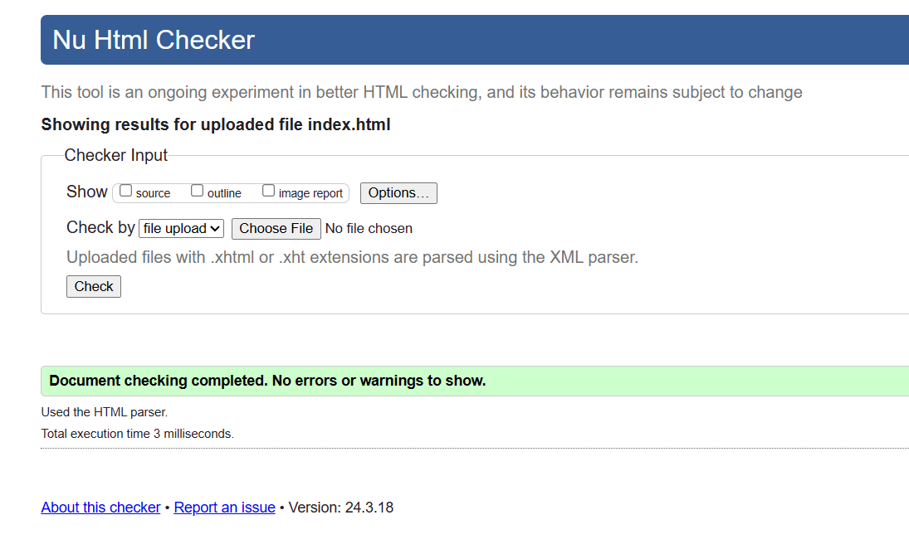

## 3. Cross-Browser and Cross-Platform Testing
### Chrome


### Edge


### Firefox


### Safari
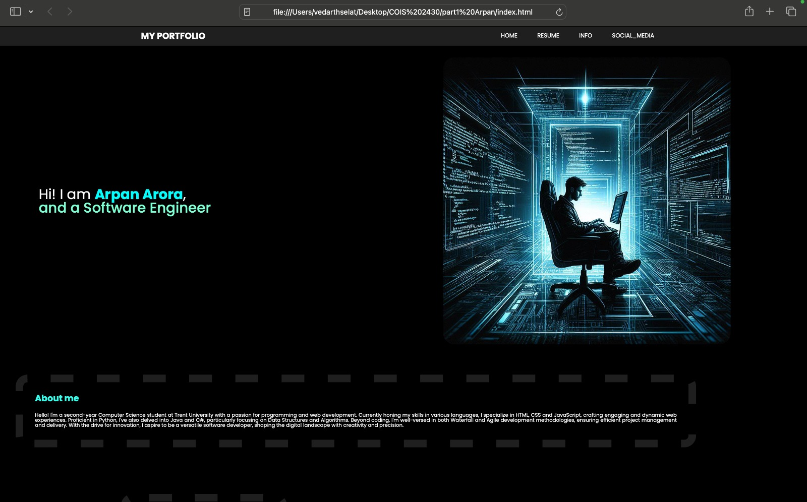
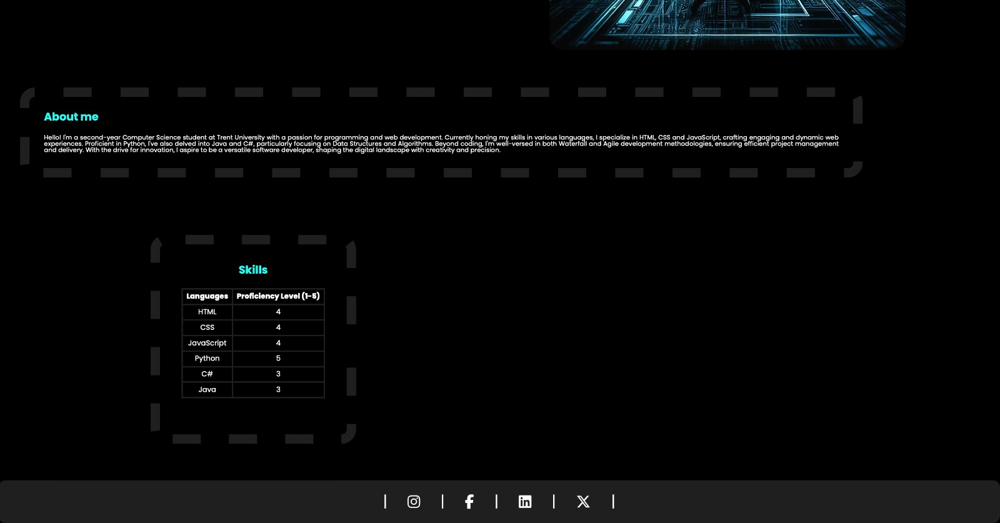

## 4. Accessibility Testing
### Color Palette
1. #000000 (Primary Background)
2. #1f1f1f (Secondary Background)
3. #ffffff (Primary Text)
4. #00ffff (Secondary Color Hover)
5. #7fffd4 (Secondary Color)

### Palette
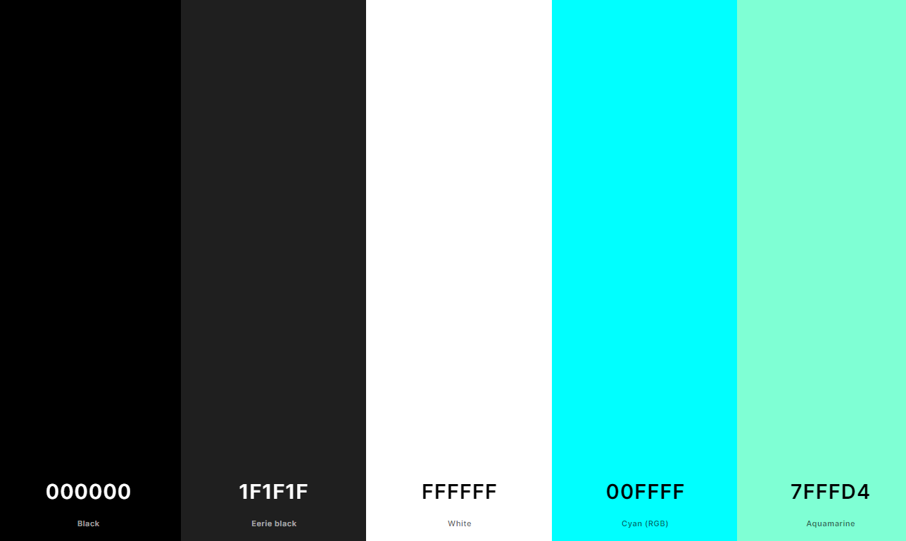

### 1. #000000 (Primary Background) tested with each color
1. #ffffff
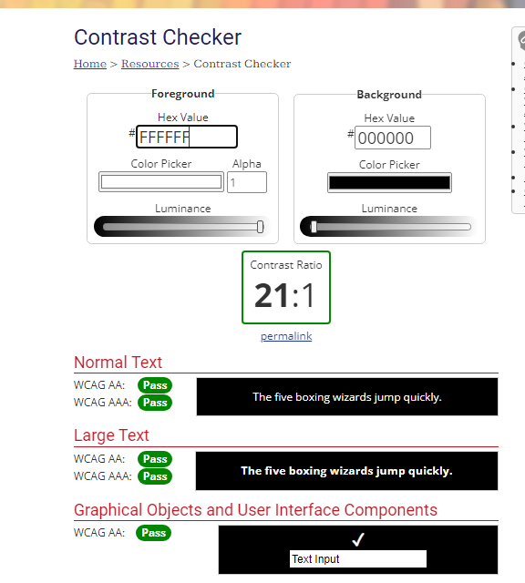

2. #00ffff
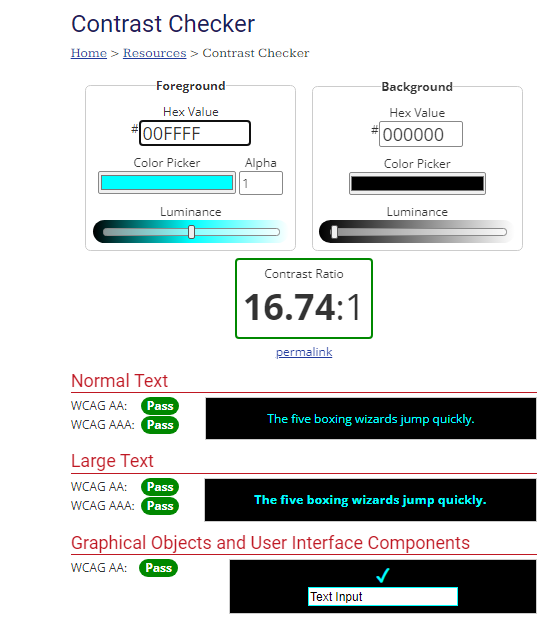

3. #7fffd4
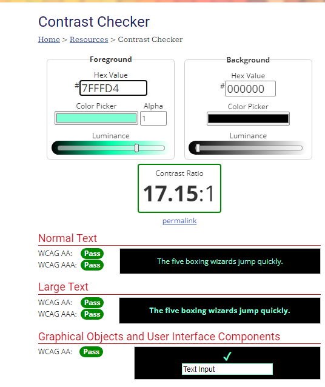

### 2. #1f1f1f (Secondary Background) tested with each color

1. #ffffff
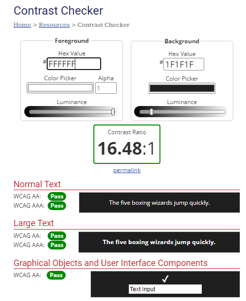

2. #00ffff

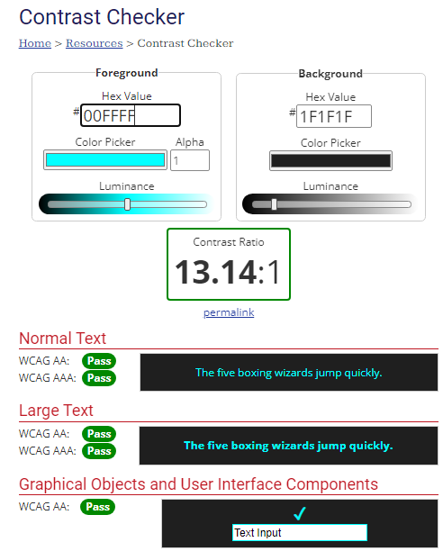

3. #7fffd4

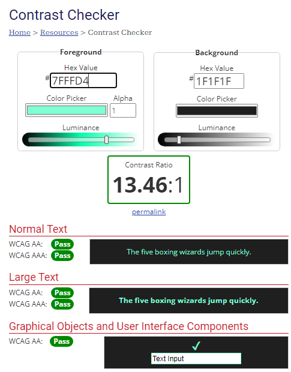

# Part 2 (CV)
## 1. Code
### HTML
```html
<!DOCTYPE html>
<html lang="en">
<head>
    <meta charset="UTF-8">
    <meta name="viewport" content="width=device-width, initial-scale=1.0">
    <title>My CV</title>
    <link rel="stylesheet" href="./styles/main2.css">
    <link rel="stylesheet" href="https://cdnjs.cloudflare.com/ajax/libs/font-awesome/6.5.1/css/all.min.css">
</head>
<body>
    <div class="main">
        <section class="left">
            <div class="profilepic">
                
            </div>
            <h2>ARPAN ARORA<br><span>WEB DEVELOPER</span></h2>
            <div class="contact">
                <h3>CONTACT</h3>
                <table>
                    <tr>
                        <td><i class="fa-solid fa-phone"></i></td>
                        <td>+1 (249) 688 XXXX</td>
                    </tr>
                    <tr>
                        <td><i class="fa-solid fa-envelope"></i></td>
                        <td>arpanarora@trentu.ca</td>
                    </tr>
                    <tr>
                        <td><i class="fa-solid fa-earth-americas"></i></td>
                        <td><a href="./index.html">My Website</a></td>
                    </tr>
                    <tr>
                        <td><i class="fa-solid fa-house"></i></td>
                        <td>364 wolf st., Peterborough, Canada</td>
                    </tr>
                </table>
                
            </div>

            <div class="ed">
                <h3>EDUCATION</h3>
                <ul>
                    <li>
                        <p><span>0000-0000</span></p>
                        <p>HIGH SCHOOL DIPLOMA, COMMERCE</p>
                        <p>IPIS, New Delhi, India</p>
                        <p>82%</p>
                    </li>

                    <li>
                        <p><span>0000-0000</span></p>
                        <p>BACHELOR OF SCIENCE (HONOURS), CS</p>
                        <p>Trent University, Peterborough, Canada</p>
                        <p>78%</p>
                    </li>
                </ul>
            </div>

            <div class="exp">
                <h3>EXPERTISE</h3>
                <ul>
                    <li>HTML</li>
                    <li>CSS</li>
                    <li>JavaScript</li>
                    <li>Python</li>
                    <li>C#</li>
                    <li>Java</li>
                </ul>
            </div>

            <div class="circle"></div>
        </section>

        <section class="right">
            <div class="about">
                <div class="dot"></div>
                <h2>PROFILE</h2>
                <p>As a dedicated technology enthusiast embarking on my programming journey, I am passionately 
                    committed to acquiring hands-on experience, honing my problem-solving abilities, and cultivating 
                    strategic thinking skills. My goal is to actively contribute to a dynamic team while continually 
                    expanding my knowledge. With a strong foundation in research and an unwavering drive to learn, I 
                    am poised to meet the evolving challenges of the technology field with enthusiasm and adaptability.
                </p>
            </div>

            
            <div class="job">
                <div class="dot"></div>
                <h2>EXPERIENCE</h2>
                <ul>
                    <li>
                        <p><span>0000-0000</span></p>
                        <p>WEB DEVELOPER</p>
                        <p>Google, Calgary, Canada</p>
                        <p>As a web developer at Google, I designed 
                            and implemented innovative solutions for 
                            complex technical challenges, contributing to the 
                            development of cutting-edge products.
                        </p>
                    </li>

                    <li>
                        <p><span>0000-0000</span></p>
                        <p>WEB DEVELOPER</p>
                        <p>Microsoft, Calgary, Canada</p>
                        <p>Web developer with Microsoft, leveraging cutting-edge 
                            technologies to create innovative web solutions that 
                            drive user engagement and enhance digital experiences.
                        </p>
                    </li>
                </ul>
            </div>

            <div class="ref">
                <ul>
                    <li>
                        <div class="dot"></div>
                        <h2>REFERENCE</h2>
                        <p>John Doe</p>
                        <p>Senior Executive, Peterborough</p>
                        <p>ABC Company, Peterborough, Canada</p>
                        <p>0000-000000</p>
                        <p>johndoe@gmail.com</p>
                        <p><a href="https://cdn.dribbble.com/userupload/11785259/file/original-49210cfd3f8dc63dfbd1bf07cd25a259.jpg?resize=752x">My Resume Reference</a></p>
                    </li>
                    <li>
                        <p>Satya Nadela</p>
                        <p>Senior Executive, Peterborough</p>
                        <p>Microsoft Company, Peterborough, Canada</p>
                        <p>0000-000000</p>
                        <p>microsoft@outlook.com</p>
                        <p><a href="https://microsoft.com/en-ca/">Microsoft</a></p>
                    </li>
                </ul>
            </div>
            <div class="circle1"></div>
        </section>
        <footer>
            <p>Resume Reference: <a href="https://cdn.dribbble.com/userupload/11785259/file/original-49210cfd3f8dc63dfbd1bf07cd25a259.jpg?resize=752x">Click Me</a></p>
        </footer>
    </div>

</body>
</html>
```

### CSS
```css
@import url(reset.css);
@import url("https://fonts.googleapis.com/css2?family=Poppins:ital,wght@0,100;0,200;0,300;0,400;0,500;0,600;0,700;0,800;0,900;1,100;1,200;1,300;1,400;1,500;1,600;1,700;1,800;1,900&display=swap");

:root{
    --primebg2: black;
    --navbarbg: #1f1f1f;
    --leftcvbg: #595859;
    --primebg: white;
    --hovercolor: cyan;
    --secondarycolor:#0198ff;
}

body {
  font-family: "Poppins", sans-serif;
  background-color:var(--primebg2);
  color: var(--primebg2);
  font-size: 1.3em;
  display:flex;
  justify-content:center;
  align-items:center;
  min-height: 100vh;
}

.main{
    width:100%;
    max-width:50em;
    min-height:50em;
    background:white;
    display:grid;
    grid-template-columns:1fr 2fr;
    margin:2.4em;
}

/* Left Section */
.left{
    background:var(--leftcvbg);
    padding:1.9em;
    display:flex;
    flex-direction:column;
    align-items:center;
    margin-right:3em;
}

.profilepic img{
    width:80%;
    border:0.3em solid var(--primebg);
    border-radius:9em;
    margin:0em 0.8em;
}

.left h2{
    color:var(--primebg);
    font-weight: 700;
    text-align:center;
    line-height:1.3em;
    margin-top:1em;
    background:var(--secondarycolor);
    width:130%;
    padding: 0.7em 0em;
}

.left h2 span{
    font-size:0.8em;
    font-weight:600;
}

.contact{
    margin-top:2em;
}

.contact h3{
    color: var(--primebg);
    margin-bottom:1em;
}

.contact table{
    font-size:80%;
    color:white;
}

.contact tr td{
    padding: 0.4em;
}

.contact a{
    text-decoration:none;
    color:var(--secondarycolor);
}

.contact a:hover{
    color:var(--hovercolor);
    font-size:110%;
}

.contact i{
    color:var(--secondarycolor);
    margin-right:1em;
}

.ed{
    margin-top:2em;
}

.ed h3{
    color: var(--primebg);
    margin-bottom:1em;
}

.ed ul li{
    font-size:90%;
    margin-bottom:1em;
}

.ed ul li span{
    color:var(--secondarycolor)
}
.ed ul li p{
    color:white;
    line-height:1.7em;
    font-size:90%;
}

.ed ul li p:nth-child(2){
    font-weight: 700;
}

.exp{
    margin-top:1em;
    align-self:flex-start;
}
.exp h3{
    color: var(--primebg);
    margin-bottom:1em;    
    font-weight:400;
}

.exp ul{
    color:white;
    line-height:1.8em;
    font-size:70%;
    font-weight:300;
}


.circle{
    position:absolute;
    opacity:30%;
    transform:translate(-6.7em, 24em);
    z-index:1;
    width:2.4em;
    height:5.3em;
    background:grey;
    border-radius:0em 15em 15em 0;
}


/* Right Section */
.right{
    background:var(--primebg);
    padding:3em;
    border-left: 0.2em solid var(--leftcvbg);
    font-size:80%;
    display:flex;
    flex-direction:column;
    align-items:center;
}

.right h2{
    margin-bottom:1em;
    font-weight:600;
    font-size: 1.4em;
    color: var(--leftcvbg);
}

.dot{
    width:1em;
    height:1em;
    background-color:var(--leftcvbg);
    position:absolute;
    transform:translateX(-3.6em);
    border-radius: 5em;
}

.about p{
    line-height:1.5em;
    text-align:justify;
    font-size: 90%;
}

.job{
    margin-top:2em;
}

.job ul li{
    font-size:90%;
    margin-bottom:1em;
}

.job ul li span{
    color:var(--secondarycolor)
}
.job ul li p{
    color:var(--primebg2);
    line-height:2em;
    font-size:90%;
}

.job ul li p:nth-child(2){
    font-weight: 700;
    font-size:1.2em
}

.job ul li p:nth-child(4){
    margin-top:1em;
}

.ref{
    margin-top:2em;
    align-self:flex-start;
}

.ref p{
    line-height:2em;
}

.ref ul li{
    margin-bottom:1em;
}

.ref ul li p:first-of-type{
    font-weight: 700;
}

.ref ul li a{
    text-decoration:none;
    color:var(--secondarycolor);
}

.ref ul li a:hover{
    color:var(--hovercolor);
    font-size:110%;
}

.circle1{
    position:relative;
    opacity:30%;
    transform:translate(18em, -42em);
    z-index:1;
    width:3em;
    height:5.7em;
    background:grey;
    border-radius:15em 0em 0em 15em;
}

@media only screen and (max-width: 37em) {
    .main {
      grid-template-columns: 1fr;
      max-width: 90%; 
      margin: 1.2em; 
    }
  
    .left {
      margin-right: 0;
    }
  
    .right {
      border-left: none;
    }
  
    .circle,
    .circle1 {
      display: none; 
    }
  }
  
```

## 2. HTML Validation
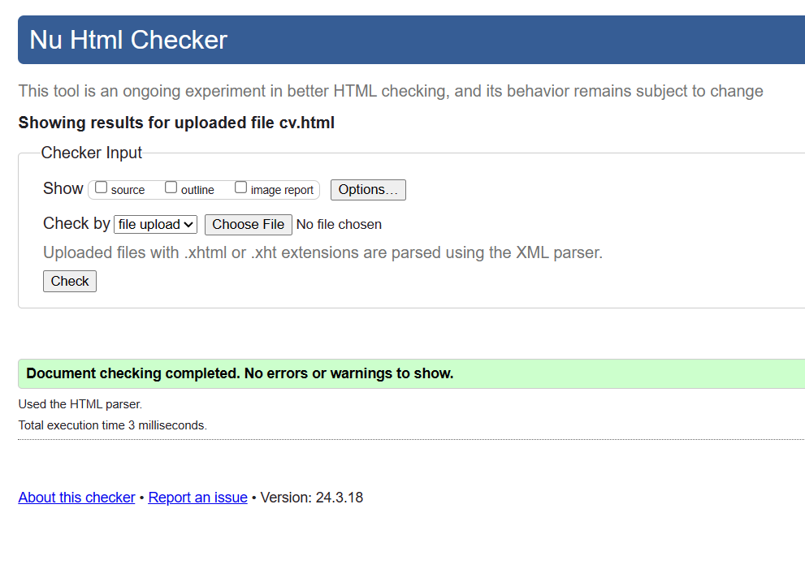

## 3. Cross-Browser and Cross-Platform Testing
### Chrome


### Edge


### Firefox


### Safari


## 4. Accessibility Testing
### Color Palette
1. #000000 (Primary Background)
2. #595859 (Secondary Background)
3. #ffffff (Primary color)
4. #00ffff (Secondary Color Hover)
5. #0198ff (Secondary Color)

### Palette
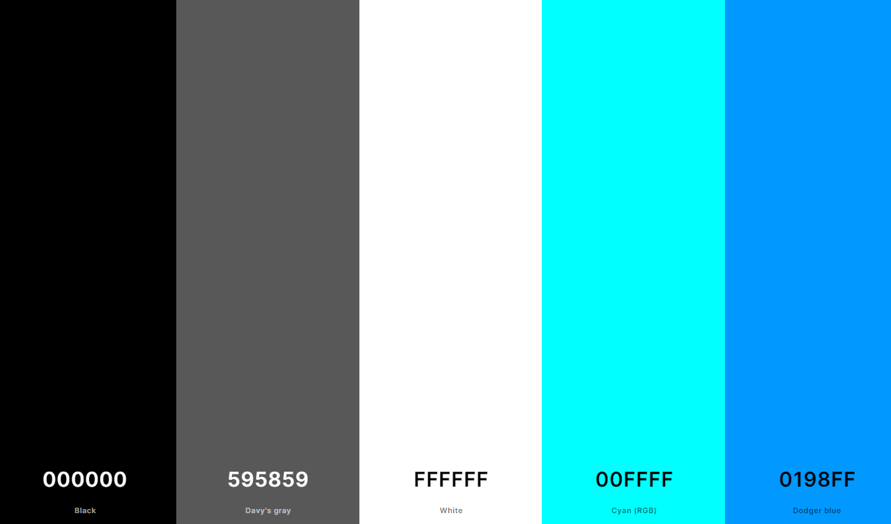

### 1. #000000 (Primary Background) tested with each color

1. #ffffff


2. #00ffff


3. #0198ff
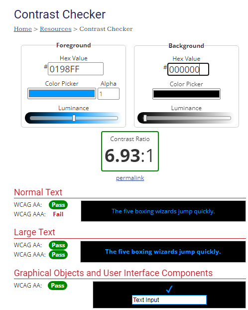

### 2. #595859 (Secondary Background) tested with each color
1. #ffffff

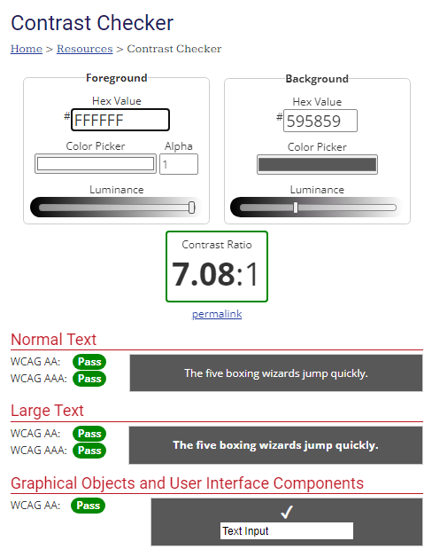

2. #00ffff
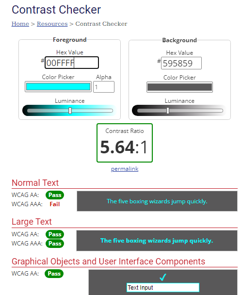

3. #0198ff (This is suppose to fail)
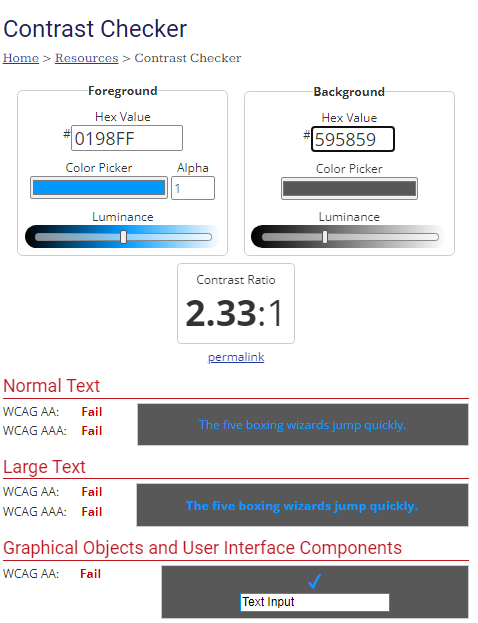

